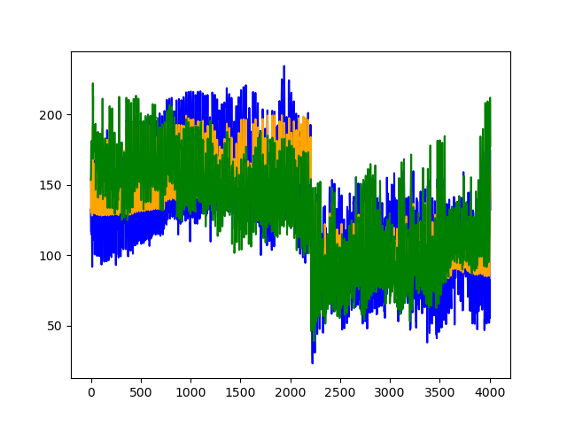
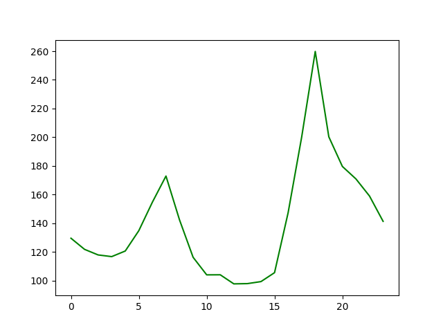

# EV Charging Model

  

## Finding a model for the data
Using scikit-learn, I modeled the effect of Caltech's EV Charging network on hourly electricity pricing at Pasadena's nearby node (GLNARMC4_7_B1). The 
data provided to the algorithm runs from 1-Oct-2019 to 18-Mar-2020, the first two semesters of Caltech's 2019-20 academic year. The input data includes
the month, time of day, weekday vs. weekend, temperature, and (most importantly) the KWH delivered by Caltech's ACN within the hour. The output is the hourly
LMP data from CAISO.

 
   x-axis is hours from first data point
   y-axis is LMP 

The above image shows how well the best available model is able to predict LMP pricing. This model is scikit-learn's Kernel Ridge, which gave us a score of 
0.28.  

The next step for this project is to develop a theoretical data set, looking at the possibility of a large employer in the Los Angeles installing an at-work 
EV Charging network. Hopefully, we will see that the model will predict that the implementation of a charging network will flatten the electricity pricing curve
throughout the day, allowing for increased consumption of renewables and more affordable energy for consumers.

  Below is the scores for all of the models.

|Model Name                |Score                  |
|--------------------------|-----------------------|
|kernel_ridge_additive_chi2|0.280029601581228      |
|kernel_ridge_linear       |0.25171742860023383    |
|kernel_ridge_polynomial   |-1.5237461472025609    |
|kernel_ridge_poly         |-1.5237461472025609    |
|kernel_ridge_rbf          |-2.3007574366038144    |
|kernel_ridge_laplacian    |-2.1856524740685583    |
|kernel_ridge_sigmoid      |-0.0009473926196315041 |
|kernel_ridge_cosine       |0.03930254770527941    |
|linear_regression         |0.25188483131431205    |
|passive_aggressive        |-20.015927380825953    |
|mlp_act=identity_sol=lbfgs|0.15103922537617143    |
|mlp_act=identity_sol=adam |-0.2485783335377867    |
|mlp_act=logistic_sol=lbfgs|0.15770882923155538    |
|mlp_act=logistic_sol=sgd  |0.04785565461096375    |
|mlp_act=logistic_sol=adam |0.05176161160475268    |
|mlp_act=tanh_sol=lbfgs    |0.13653167856174664    |
|mlp_act=tanh_sol=sgd      |0.04188879656836819    |
|mlp_act=tanh_sol=adam     |0.08996525273660128    |
|mlp_act=relu_sol=lbfgs    |0.12860314580044274    |
|mlp_act=relu_sol=sgd      |-1.1867135788212708e+80|
|mlp_act=relu_sol=adam     |0.022185230661251554   |
  

## Generating the theoretical data
In order to create a data set that could model the amount of KWHs delivered by a newly-installed Charging network, I used the sum of a couple normal distributions (optimized over their mean and standard deviation), and then scaled up by the amount of chargers that would be present in Northrop Grumman's network. I found that the curve did, in fact, flatten slightly. Using the top three models from our testing, I calculated a couple things: firstly, the predicition for each hour over the interval with the new charging data.

  

This is, more or less, complete nonsense. If we instead take a look at each of the models individually, and take the pricing they predict over an average day, we get the following:

  
    Our best model, the Kernel Ridge Additive Chi2, for an average day.
    
    Linear regression, our second best model, gives us the above estimate.
    
    Finally, our multilayer perceptron's estimate.

Now let's compare these graphs to that of our calculate daily LMP in Pasadena.

  

This shows us that all of our top 3 models predict that the curve will be much flatter than before! This is great news, and is even further shown by our weighted average model of the top 3 models:

  

